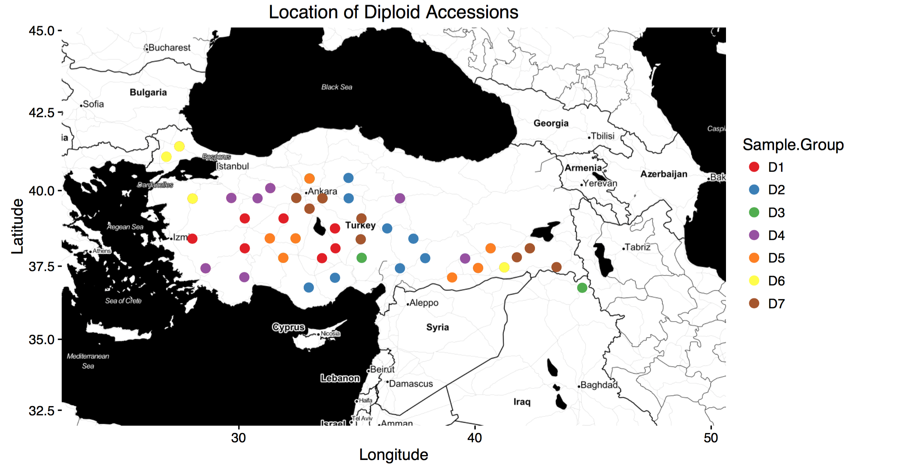
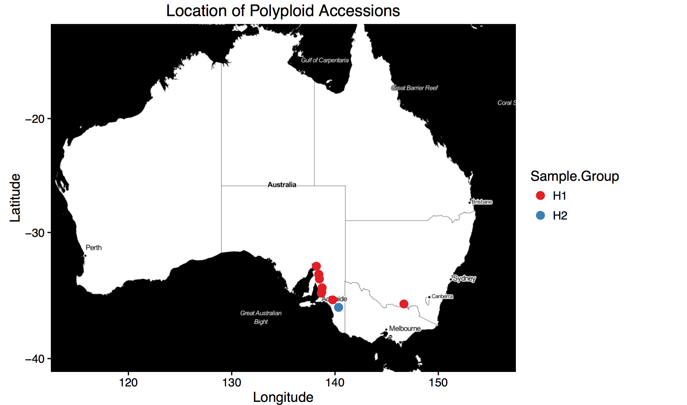
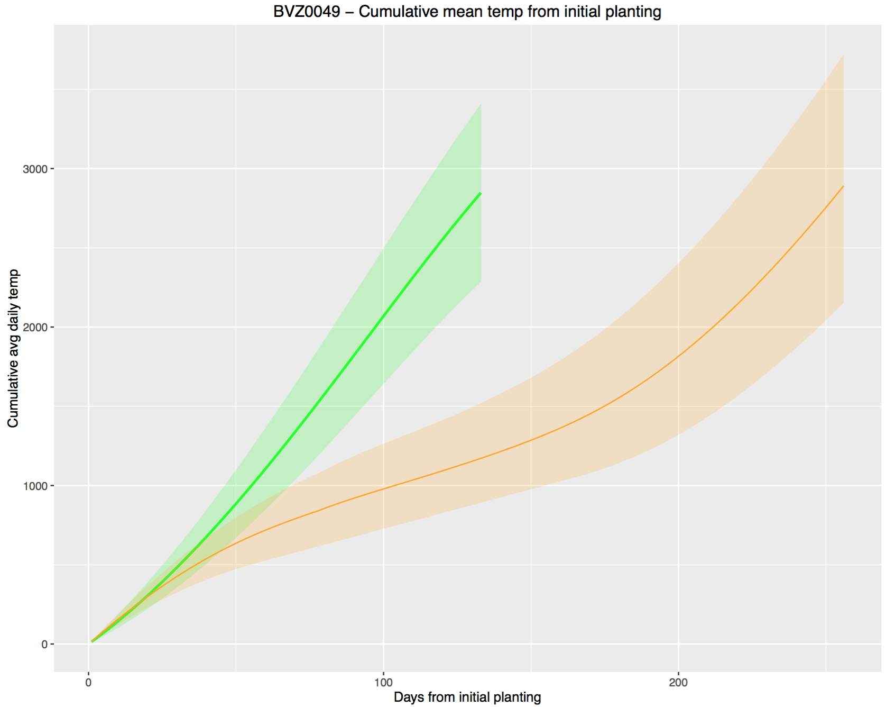
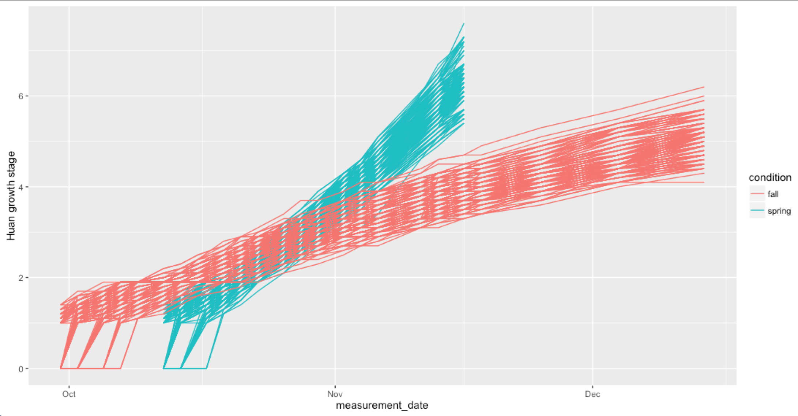
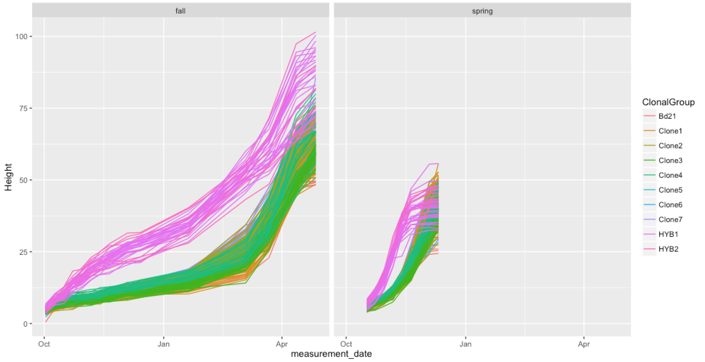

# Borevitz Lab meeting
## April 6th, 2017
___

### DECRA Project Updates

552 of 604 libraries have been sequenced so far. A single plate remains to cover any redos / low coverage samples / final additions.

All reads run through QC, aligned, and compared to confirm general expected relationship (correlation matrix of 100bp tiles of methylation data) based on initial 'low-diversity' GBS classification.

GPS coordinates of turkish samples colored by 'family'

GPS coordinates of Aus _B.hybridum_ acessions

Initial check of environments for spring and fall plantings for BVZ0049

- Chambers basically did what they were programmed to do.
- A few hiccups here and there
- Clearly different environments

Phenotype data is being validated and initial looks.
Clear faster growth stages in spring condition.

Plant height highlights rapid cycling in spring and longer lived, taller plants in fall. Both show vigor of hybridum.

### MinION Updates
